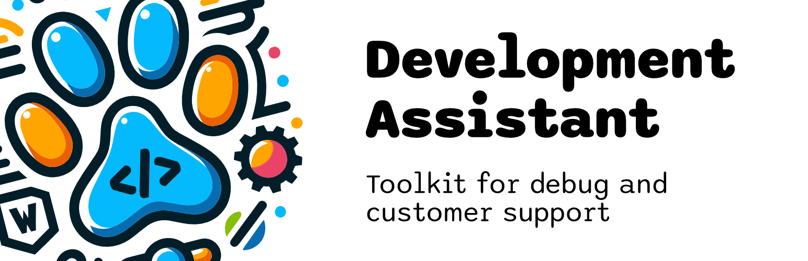

# Development Assistant

Development Assistant is an open-source WordPress plugin that brings practical
debugging and customer-support tools into the WordPress admin area. It helps site
owners, developers, and support teams diagnose problems without repeatedly
editing configuration files or assembling temporary troubleshooting workflows
by hand.

[WordPress.org](https://wordpress.org/plugins/development-assistant/) ·
[Support](SUPPORT.md) · [Report a bug](https://github.com/dpripa/development-assistant/issues) ·
[Security](SECURITY.md)

## What It Does

- **Manage WordPress debugging:** Enable and inspect `WP_DEBUG`, `WP_DEBUG_LOG`,
  and `WP_DEBUG_DISPLAY` from the admin interface. Configuration changes are
  validated, backed up, and rolled back when they cannot be verified.
- **Work with the debug log:** Review, download, clear, and protect the WordPress
  debug log without reaching for server tools for every support session.
- **Create temporary support access:** Create a support user, choose when it
  expires, copy its credentials, or share access by email with an optional
  message.
- **Isolate plugin conflicts:** Temporarily deactivate plugins during diagnosis
  and restore their previous activation state when troubleshooting is complete.
- **Download installed plugins:** Download plugin packages directly from the
  Plugins screen for inspection, testing, or transfer to a sandbox.
- **Restore the original state:** Reset Development Assistant data and restore
  the debug configuration and temporary plugin state managed by the plugin.

## Designed for Safer Troubleshooting

Development Assistant treats changes to `wp-config.php` and `.htaccess` as
recoverable operations. It checks whether the host permits modification, keeps
protected recovery data, verifies writes, and rolls back failed changes instead
of reporting success prematurely.

The plugin also distinguishes temporary support state from permanent WordPress
configuration so deactivation and reset behavior remain explicit and
predictable.

## Requirements

- WordPress 5.0 or later
- PHP 7.4 or later

## Installation

Install **Development Assistant** from **Plugins → Add New** in WordPress, or
download it from the official
[WordPress.org plugin page](https://wordpress.org/plugins/development-assistant/).
Versioned release archives, including prereleases, are also available from
[GitHub Releases](https://github.com/dpripa/development-assistant/releases).

To install a downloaded archive manually, open **Plugins → Add New → Upload
Plugin** in WordPress and upload the ZIP file.

After activation, open the Development Assistant settings in the WordPress admin
area and enable only the tools needed for the current troubleshooting session.

## Help and Feedback

- Use the [WordPress.org support forum](https://wordpress.org/support/plugin/development-assistant/)
  for installation, configuration, and usage questions.
- Use [GitHub Issues](https://github.com/dpripa/development-assistant/issues) for
  reproducible bugs and focused feature proposals.
- Report suspected vulnerabilities privately according to
  [SECURITY.md](SECURITY.md).

## Contributing and Project Documentation

Start with [CONTRIBUTING.md](CONTRIBUTING.md) before proposing a change. The
following documents define the development and project-maintenance rules:

- [Development environment and commands](docs/DEVELOPMENT.md)
- [Architecture](docs/ARCHITECTURE.md)
- [Release policy](docs/RELEASE_POLICY.md) for verified release maintainers
- [Code of Conduct](CODE_OF_CONDUCT.md)
- [Support policy](SUPPORT.md)
- [Security policy](SECURITY.md)

## License

Development Assistant is licensed under
[GPL-2.0-or-later](license.txt).
